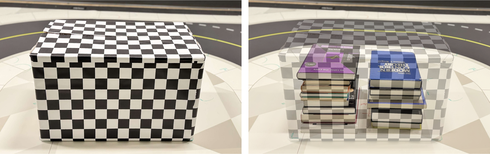

# Mobile WiFi CSI-Based Object Detection

**The dataset will be published here after the acceptance of the paper**

This paper presents a novel approach for passively detecting the presence of objects within enclosed spaces using WiFi-based sensing integrated with autonomous mobile robots. Utilizing the Quanser QCar, a 1/10-scale vehicle equipped with WiFi Channel State Information (CSI) sniffers, we investigate scenarios where robots determine, without any intrusion, whether a closed container contains an object. This detection is achieved passively from outside the box,  in the absence of any line of sight. The study examines the influence of robot movement and velocity on the accuracy of this non-invasive detection approach. Our findings highlight the feasibility of employing mobile robots and WiFi sensing with CSI for passive inspection tasks, showcasing its potential in scenarios requiring object presence detection without direct interaction.

# Floor Plan
The floor plan of the lab is depicted in the following. The robot uses 2 different velocities and 2 different radii to collect data.

The Box in the middle is either filled or empty. The filled box is depicted in the following picture. The goal is to detect whether the closed box is filled or empty using WiFi CSI scans.

## Examples
You can find relavant examples to use this dataset in the `examples` directory.

